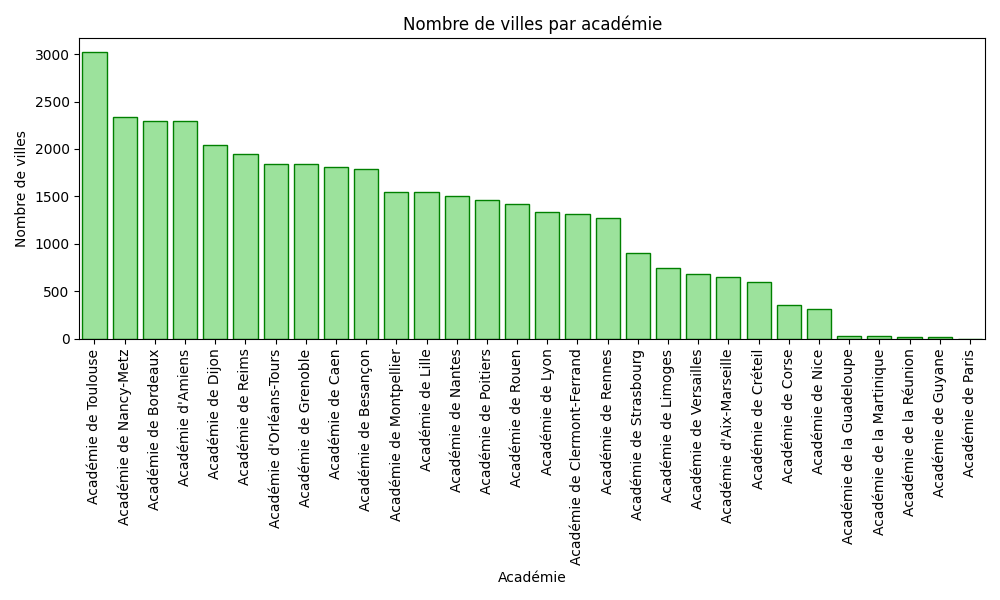

INFO834 - Bases de données distribuées
# TP2 : Parquet

## Installation

```bash
pip install pyarrow pandas matplotlib seaborn
```

```
mkdir data
cd data
```

Télécharger ces données et les placer dans le dossier `data` :

- [academies.csv](https://drive.google.com/file/d/156usePkEZWrUl8xdsteltsq6T2VPHoJi/view?usp=sharing)
- [villes.csv](https://drive.google.com/file/d/1Nz_bJp_UyR2C-caO_xwFpcph9vykC9q3/view?usp=sharing)

## Exécution 

```bash
python tp2.py
```

## Résultats

### Affichage des statistiques



### Compression des fichiers Parquet

- Taille du fichier csv d'origine : 5922.97 Ko
- Taille du dataset partionné : 1961.03 Ko (33.11% du fichier d'origine)
- Compression `snappy` : 1119.89 Ko (18.91% du fichier d'origine)
- Compression `brotli` : 865.67 Ko (14.62% du fichier d'origine)
- Compression `gzip` : 902.62 Ko (15.24% du fichier d'origine)
- Compression `zstd` : 945.41 Ko (15.96% du fichier d'origine)
- Compression `lz4` : 1122.02 Ko (18.94% du fichier d'origine)
- Compression `none` : 1451.47 Ko (24.51% du fichier d'origine)

